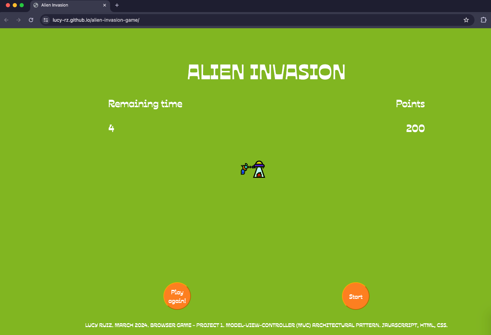

# Alien Invasion - Browser game
Alien invasion is a game where the player must save humanity by clicking the spaceships with the tip of the laser gun, that will randomly appear on the screen during a couple of seconds. 
If the player achieves certain amount of points, they will be the saviour of the planet; if not... Well, you can play again!

# Screenshot

# Technologies used
- JavaScript
- HTML
- CSS

# Getting started
- https://lucy-rz.github.io/alien-invasion-game/
- https://trello.com/b/U1IwBAFw/alien-invasion-game

# Future steps
- Create levels based on time and points.
- Add more spaceship models.
- Create a pause button.
